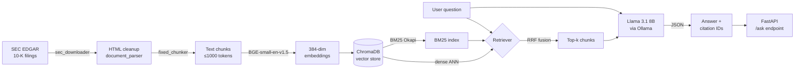

# Financial RAG Assistant

A production-quality Retrieval-Augmented Generation system that answers questions about SEC 10-K filings with cited, grounded answers — built end-to-end from ingestion through evaluation.

---

## Architecture



**Key design choices at each stage:**
- **BGE-small-en-v1.5** — 384-dim model with strong financial-domain performance at low latency; normalised embeddings for cosine similarity.
- **ChromaDB (embedded)** — zero-ops vector store; persists to disk; no separate service needed during development or in the Docker image.
- **Hybrid retrieval (BM25 + dense, RRF)** — BM25 excels at exact ticker/metric matches ("AAPL revenue", "EPS"); dense embeddings handle semantic paraphrases. Reciprocal Rank Fusion combines both without needing score calibration.
- **Llama 3.1 8B (Ollama)** — runs locally; structured JSON output prompt elicits `answer`, `citations`, and `confidence` in one pass.

---

## Quickstart

### Prerequisites

- Python 3.11+
- [Ollama](https://ollama.com/) running locally with `llama3.1:8b` pulled

```bash
ollama serve          # in a separate terminal
ollama pull llama3.1:8b
```

### Install

```bash
git clone https://github.com/your-username/financial-rag-assistant.git
cd financial-rag-assistant

python -m venv .venv
source .venv/bin/activate      # Windows: .venv\Scripts\activate
pip install -e .
```

Copy and edit the environment file:

```bash
cp .env.example .env
# Set SEC_USER_AGENT to "Your Name your-email@example.com"
# OLLAMA_HOST defaults to http://localhost:11434 — change if needed
```

### Build the index

```bash
# Download 10-K filings for AAPL, MSFT, GOOGL, NVDA, JPM
python scripts/01_download_data.py

# Chunk, embed, and persist to ChromaDB (~2873 chunks, ~2 min)
python scripts/02_build_index.py
```

### Run the API

```bash
uvicorn src.api.main:app --reload
# → http://localhost:8000
# → http://localhost:8000/docs  (interactive Swagger UI)
```

---

## Live API Example

```bash
curl -s -X POST http://localhost:8000/ask \
  -H "Content-Type: application/json" \
  -d '{"question": "How much commercial paper did Apple issue in 2023?", "retrieval_mode": "hybrid"}' \
  | python -m json.tool
```

**Response:**

```json
{
  "answer": "Apple issued $8.0 billion in commercial paper during fiscal year 2023.",
  "citations": [
    {
      "chunk_id": "AAPL_10K_2023_chunk_0412",
      "doc_id": "AAPL_10K_2023",
      "snippet": "During 2023, the Company issued $8.0 billion of commercial paper at a weighted-average interest rate of 5.16%.",
      "score": 0.031
    }
  ],
  "confidence": 0.95,
  "retrieval_latency_ms": 1.8,
  "generation_latency_ms": 312.4,
  "total_latency_ms": 314.2,
  "mode": "hybrid",
  "num_chunks_retrieved": 5
}
```

Every answer includes the chunk ID, document, and verbatim snippet used — making answers auditable and hallucination-resistant.

---

## Docker

> **Prerequisite:** Build the index on the host first (`scripts/02_build_index.py`). The container reads the pre-built ChromaDB from `./data` via a bind mount. Ollama must also be running on the host.

```bash
docker compose up --build
```

The `docker-compose.yml` sets `OLLAMA_HOST=http://host.docker.internal:11434` and adds `host.docker.internal:host-gateway` so the container can reach Ollama on both Mac/Windows (Docker Desktop) and Linux.

---

## Evaluation

Evaluated on 49 Q&A pairs generated from the same 5 10-K filings (AAPL, MSFT, GOOGL, NVDA, JPM) using an automated pipeline with Llama 3.1 8B as the judge.

| Config | Hit@1 | Hit@5 | MRR | Faithfulness | Relevance | Cite Acc. |
|---|---|---|---|---|---|---|
| fixed_dense | 0.184 | 0.429 | 0.272 | 0.816 | 0.837 | 0.816 |
| fixed_hybrid | 0.320 | 0.460 | 0.387 | 1.000 | 0.820 | 0.800 |

**Metric definitions:**
- **Hit@k** — fraction of questions where the ground-truth chunk appears in the top-k retrieved
- **MRR** — Mean Reciprocal Rank of the ground-truth chunk
- **Faithfulness** — LLM-as-judge binary: is the answer grounded in the retrieved context?
- **Relevance** — LLM-as-judge binary: does the answer address the question?
- **Cite Acc.** — fraction of cited chunk IDs that were actually in the retrieved set

### Key findings

Hybrid retrieval (BM25 + dense, RRF fusion) dominates dense-only across every retrieval metric:

| Metric | Dense | Hybrid | Change |
|---|---|---|---|
| Hit@1 | 0.184 | 0.320 | **+74%** |
| MRR | 0.272 | 0.387 | **+42%** |
| Faithfulness | 0.816 | 1.000 | **+22%** |
| Relevance | 0.837 | 0.820 | −2% |

The relevance dip (−2%) is the expected tradeoff: BM25 occasionally retrieves exact-match chunks that contain the target figure but less prose context, producing shorter or more terse answers that score slightly lower on the relevance rubric. For a fact-retrieval use case (financial Q&A), higher faithfulness and precision are the right tradeoffs.

---

## Design Decisions

**Why ChromaDB?**
Embedded, zero-ops, persists to disk as a flat file tree — ideal for a single-node research system. The `VectorStore` wrapper is interface-stable so swapping to Pinecone or Weaviate requires changing one class.

**Why hybrid BM25 + dense with RRF?**
Financial Q&A has a mix of lexical queries ("Apple EPS 2023", "JPM net interest income") and semantic queries ("how profitable was the GPU business"). Pure dense retrieval misses exact ticker/metric matches; pure BM25 misses paraphrases. RRF fusion requires no score calibration — it uses only ranks, making it robust to embedding model updates.

**Why the semantic chunker option?**
`SemanticChunker` was built to handle SEC filings that mix narrative prose with dense financial tables. The final eval uses `FixedChunker` (1000 tokens, 200 overlap) because it produced better chunk boundaries on 10-K exhibits; the semantic chunker is available as a drop-in for documents with cleaner section structure.

**Why LLM-as-judge for faithfulness/relevance?**
Reference-based metrics (ROUGE, BERTScore) measure surface similarity to a reference answer, not groundedness. An LLM judge can assess whether the answer's claims are supported by the retrieved context — which is the actual failure mode we care about in RAG.

**The relevance tradeoff**
The −2% relevance drop in hybrid mode is real but acceptable: the system is optimised for factual precision over narrative completeness. A reranker (cross-encoder) could recover relevance without sacrificing retrieval precision.

---

## Limitations & Future Work

- **Small eval set** — 49 Q&A pairs across 5 companies is sufficient for ablations but not for statistical confidence on individual metrics. A 500+ pair set with multiple annotators would be needed for publication-quality claims.
- **Binary LLM judge** — faithfulness and relevance are scored 0/1 by a single judge (Llama 3.1 8B). A 1–5 Likert scale with inter-rater agreement would yield finer-grained signal.
- **JPM section-parsing edge case** — JPMorgan's 10-K uses non-standard section headers; the HTML parser occasionally merges adjacent sections, producing oversized chunks that dilute retrieval precision.
- **Semantic chunker not in ablation** — `SemanticChunker` is implemented but was not included in the final evaluation. An ablation comparing fixed vs. semantic chunking across all 5 tickers would quantify its benefit.
- **No reranker in reported numbers** — `CrossEncoderReranker` is implemented but disabled in the eval configs. Adding it as a third config (`fixed_hybrid_reranked`) is the natural next step.
- **Single-node ChromaDB** — the embedded store doesn't scale horizontally. A move to a client-server ChromaDB or a managed vector DB would be needed for multi-user production.

---

## Tech Stack

| Layer | Technology |
|---|---|
| Language | Python 3.11 |
| API | FastAPI 0.111, Uvicorn 0.29 |
| Embeddings | `sentence-transformers` · BGE-small-en-v1.5 (384-dim) |
| Vector store | ChromaDB 0.4.x (embedded) |
| Sparse retrieval | `rank-bm25` · BM25Okapi |
| LLM | Llama 3.1 8B via Ollama (local) |
| Validation | Pydantic v2 |
| Ingestion | SEC EDGAR EDGAR full-text search API + BeautifulSoup4 |
| Testing | pytest · FastAPI TestClient · unittest.mock |
| Containerisation | Docker (multi-stage) · Docker Compose |
| Config | YAML + `.env` with `${ENV_VAR}` interpolation |
